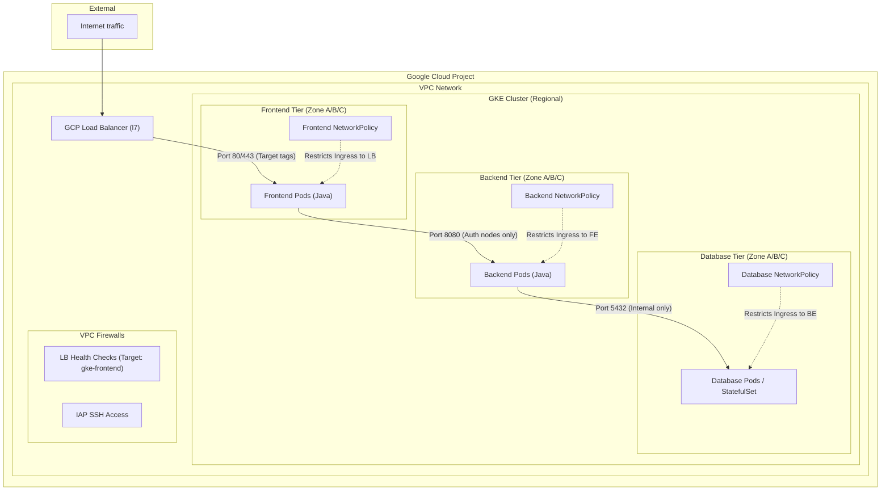

# Production-Ready HA GKE Cluster Walkthrough

## 0. Architecture Diagram



## 1. Project Architecture

The project is broken into specialized modules for better lifecycle management:

```text
gke/
├── main.tf           # Orchestrates modules & applies K8s manifests
├── locals.tf         # Centralized configuration (Project IDs, Tags, Labels)
├── provider.tf       # Google & Kubernetes provider configuration
├── modules/
│   ├── vpc/          # Custom VPC & tag-based Firewall Rules
│   ├── gke_cluster/  # Regional HA Control Plane
│   └── node_pool/    # Distributed Node Pool with Network Tags
└── k8s/
    └── network-policies/ # Firewall-as-code manifests
```

## 2. Multi-Layer Security (Firewall-as-Code)

We have implemented security at two distinct levels to ensure a "Defense in Depth" approach:

### Infrastructure Layer (VPC Firewalls)
- **Tag-based Isolation**: The Load Balancer firewall rule uses `target_tags = ["gke-frontend"]`. Traffic will only reach nodes specifically designated for frontend duties.
- **IAP Access**: SSH is restricted to Google's Identity-Aware Proxy range, eliminating the need for public IPs on nodes.

### Application Layer (K8s Network Policies)
- **Tier Isolation**: Enforces the flow: `Frontend` → `Backend` → `Database`.
- **Ingress Lockdown**: The Frontend only accepts traffic coming from the official Google Cloud Load Balancer IP ranges.
- **Enabled via Dataplane V2**: Uses Cilium (eBPF) for high-performance policy enforcement.

## 3. Full Automation (No Manual Touch)

- **Dual-Provider Strategy**: We use the `google` provider for infrastructure and the `kubernetes` provider for configuration.
- **The Link**: Terraform automatically fetches the cluster's credentials and Master CA to apply the Network Policies in `k8s/network-policies/` the moment the nodes are ready.
- **Remote State**: Configured with a GCS backend in `provider.tf` to ensure state is shared securely and locked during updates.

---

## 4. Deployment Steps

> [!IMPORTANT]
> Update the `project_id` and `bucket` (state storage) details in `locals.tf` and `provider.tf`.

1.  **Create State Bucket**:
    ```bash
    gsutil mb gs://your-unique-tfstate-bucket
    ```
2.  **Initialize**:
    ```bash
    terraform init
    ```
3.  **Deploy Everything**:
    ```bash
    terraform apply
    ```

## 5. Summary of Built-in Features
- **High Availability**: Regional control plane spread across 3 zones.
- **Least Privilege**: Nodes run with a dedicated, restricted service account.
- **Centralized Tags**: Labels and network tags are managed in a single `locals.tf` file.
